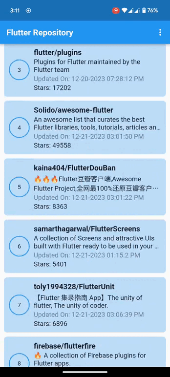
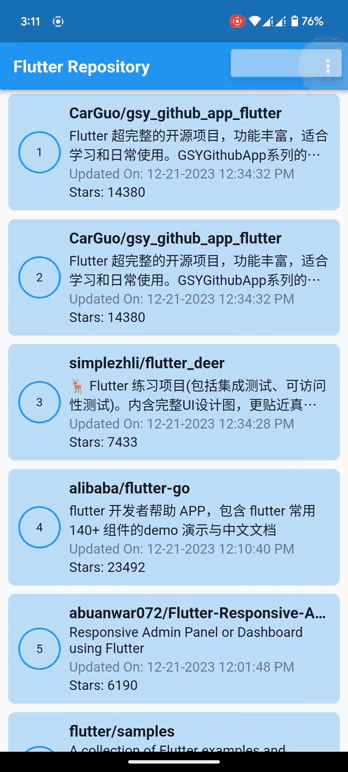
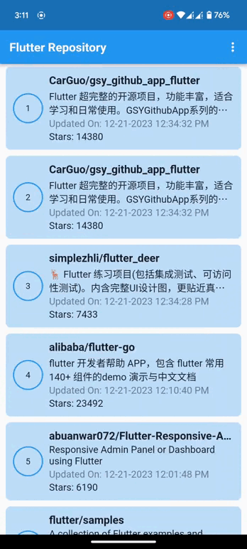

## Github Repository Search
I created a program that gets information from a GitHub repository. Specifically, it looks for repositories related to "Flutter" using the GitHub API. After finding the data through the API, the app stores it in a local database for offline access. I also implemented pagination to continuously load more data.


----------```Swipe to Scroll```--------------------```Sorting```----------------------```Details```--------
       


----------```First time loading```--------------------```No Internet to Internet```--------------------
   


# Used Library Of This Project
1. [Provider](https://pub.dev/packages/provider) package for State management
2. [Get It](https://pub.dev/packages/get_it) package for Dependency Injection
3. [Dio](https://pub.dev/packages/dio) package for Network call
4. [Floor](https://pub.dev/packages/floor) package for Local Database

# Project Architecture
I used MVVM architectural pattern in this project.

### Directory Structure
The following is a high level overview of relevant files and folders.

```
.
├── config
│   ├── route
│   │   └── app_route.dart
│   └── theme
│       └── light_theme.dart
├── core
│   ├── constants
│   │   └── constants.dart
│   ├── resources
│   │   └── data_state.dart
│   └── usecase
│       └── usecase.dart
├── data
│   ├── data_source
│   │   ├── local
│   │   │   ├── app_database.dart
│   │   │   ├── app_database.g.dart
│   │   │   └── repo_dao.dart
│   │   └── remote
│   │       └── dio_client.dart
│   ├── models
│   │   ├── base
│   │   │   └── repo.dart
│   │   ├── repo.dart
│   │   └── repo_response.dart
│   ├── repository
│   │   ├── article_repository_impl.dart
│   │   └── base
│   │       └── repo_repository.dart
│   └── usecase
│       ├── get_local_repo.dart
│       └── get_repo.dart
├── di_container.dart
├── helper
│   ├── app_text_data.dart
│   └── extension_function.dart
├── main.dart
├── provider
│   └── repo_provider.dart
└── ui
    ├── all_repo
    │   ├── all_repo_screen.dart
    │   └── widget
    │       └── all_repo_widget.dart
    ├── common
    │   ├── circular_image.dart
    │   ├── custom_image.dart
    │   ├── custom_widget.dart
    │   ├── loader.dart
    │   └── text_style.dart
    └── details_repo
        └── details_repo_screen.dart
```


# Unfinished Task
- Data Refreshing every 30 minutes
- Write Unit & UI test case
- Adding Flavor


